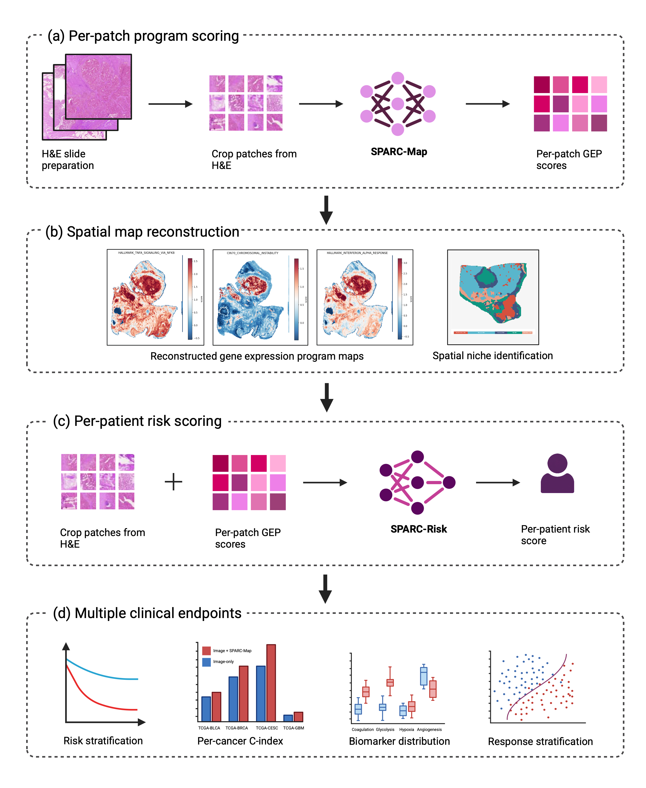
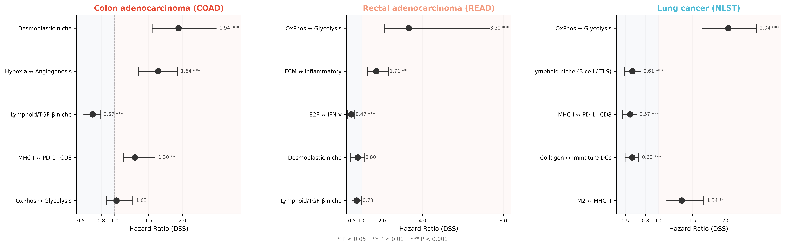
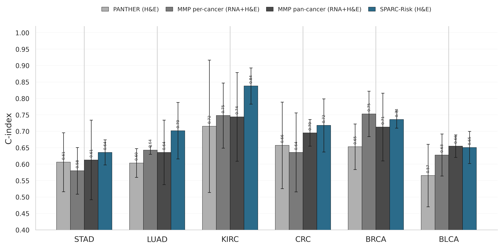
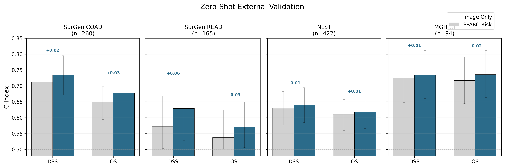

# SPARC

**Gene-program-aware survival modelling from H&E whole-slide images.**

SPARC is a two-stage pipeline:

1. **SPARC-Map** predicts 40 hallmark gene-expression-program (GEP) scores per
   H&E patch directly from the image, recovering a *spatial* molecular map of
   the slide and enabling unsupervised niche discovery.
2. **SPARC-Risk** fuses those per-patch GEP scores with the same H&E features
   through a signature-query attention head and a cancer-aware gating
   mechanism, producing a single per-patient risk score that drives
   prognostic stratification, biomarker readouts, and treatment-response
   prediction.

The repository ships training code for SPARC-Risk, an image-only baseline,
and a late-fusion ablation, plus the inference / TME analysis / figure
scripts used in the paper.

<p align="center">
  
</p>

---

## Repository layout

```
sparc-public/
├── configs/                  Canonical training configs (YAML)
│   ├── sparc_risk.yaml
│   ├── image_only.yaml
│   └── late_fusion.yaml
├── data/                     Splits + clinical CSVs (small text files only)
├── sparc/                    Core Python package (models, data, utils)
├── train.py                  5-fold cross-validation training entry point
├── inference/                External-cohort inference pipeline
│   ├── core.py               Cohort-agnostic primitives
│   ├── cohorts.py            Per-cohort declarative configs (NLST, SurGen, Ömer)
│   ├── run.py                Unified CLI
│   └── training_cohort.py    Training-cohort prediction generator
├── analysis/                 TME / spatial analysis + figure scripts
│   ├── spatial_tcga.py       Pan-TCGA niche discovery + cross-correlation
│   ├── spatial_external.py   SurGen + NLST external spatial analysis
│   ├── generate_spatial_figures.py   Fig. 3a–d, supp. Figs 5/6/8/9
│   └── niche_atlas.py        Supp. Figs 1–2 (compact niche atlases)
├── notebooks/                Paper notebooks (figure regeneration)
└── tests/                    Smoke tests (no GPU / data required)
```

## Quick start

```bash
# Install
git clone https://github.com/aziz-ayed/SPARC.git && cd SPARC
conda env create -f environment.yml
conda activate sparc

# Confirm the package builds
pytest tests/

# Train SPARC-Risk (5-fold CV, 1 GPU)
python train.py --config configs/sparc_risk.yaml

# Run external-cohort inference (4 GPUs in parallel)
python -m inference.run --cohort nlst \
    --checkpoint_dir checkpoints/sparc_risk \
    --gpus 0,1,2,3

# Regenerate the niche-atlas supplementary figures
python -m analysis.niche_atlas
```

## Highlights

<table>
  <tr>
    <td align="center" width="50%">
      <b>① Spatial molecular maps from H&E</b><br>
      <br>
      <sub>SPARC-Map turns each whole slide into a per-patch gene-program
      map. Unsupervised clustering recovers spatially coherent niches —
      proliferative, stromal, immune-inflamed, and lymphoid compartments
      separate cleanly without any human annotation.</sub>
    </td>
    <td align="center" width="50%">
      <b>② Niches stratify survival across tissues</b><br>
      <br>
      <sub>Forest plot of per-niche / per-pair hazard ratios in colorectal
      cancer (SurGen) and lung cancer (NLST). The same SPARC-Map niches
      identify protective and adverse compartments across two independent
      cohorts and tissue types.</sub>
    </td>
  </tr>
  <tr>
    <td align="center" width="50%">
      <b>③ Outperforms multimodal baselines</b><br>
      <br>
      <sub>Per-cancer C-index of SPARC-Risk (H&E only) versus PANTHER,
      MMP per-cancer, and MMP pan-cancer (which use H&E + bulk RNA) on
      the held-out TCGA test split.</sub>
    </td>
    <td align="center" width="50%">
      <b>④ Generalises zero-shot to external cohorts</b><br>
      <br>
      <sub>Without retraining, the same SPARC-Risk weights stratify
      survival in three external cohorts (NLST lung, SurGen CRC, Ömer
      CRC), demonstrating transfer beyond TCGA.</sub>
    </td>
  </tr>
</table>

## Data

The configs and inference pipeline expect:

| Path / env-var | Contents |
|---|---|
| `data/mmp_hybrid_splits_v2_20cancer.csv` (committed) | 5-fold CV splits over 20 TCGA cancers |
| `data/clinical_dss.csv` (committed) | Disease-specific survival labels |
| `$SPARC_TCGA_GEP` (default `features/tcga/predicted_programs_transformer/`) | Per-slide gene-program HDF5s |
| `$SPARC_TCGA_COORD` (default `features/tcga/hoptimus1/`) | Per-slide image-feature HDF5s |
| `$SPARC_NLST_*`, `$SPARC_SURGEN_*`, `$SPARC_OMER_*` | External-cohort feature directories |

See `data/README.md` for the full layout. Patch features are large and are
**not** committed to this repository — see the data README for download
instructions and the feature-extraction protocol.

## Trained checkpoints

The 5-fold checkpoints for **SPARC-Risk** and the **image-only baseline**
are released as a gated Hugging Face repo:
[huggingface.co/azizayed/SPARC](https://huggingface.co/azizayed/SPARC).

Access is auto-approved after you accept the non-commercial licence on the
HF model page. Then:

```bash
pip install -U "huggingface_hub[cli]"
hf auth login
hf download azizayed/SPARC --local-dir checkpoints

# Run inference on an external cohort
python -m inference.run --cohort nlst --checkpoint_dir checkpoints/sparc_risk
```

The download lands two subdirectories: `checkpoints/sparc_risk/` (canonical)
and `checkpoints/image_only/` (baseline). Each folder contains five
checkpoints `fold_{0..4}_best.pt`.

## Reproducing paper figures

| Figure | Script / notebook |
|---|---|
| Fig. 3a–d, Supp. Figs 5/6/8/9 (spatial / TME) | `python -m analysis.generate_spatial_figures` |
| Supp. Figs 1–2 (niche atlases) | `python -m analysis.niche_atlas` |
| MMP comparison | `notebooks/compare_with_baselines.ipynb` |
| Cross-fold + KM + gate analysis | `notebooks/compare_es_models.ipynb` |
| Multivariable Cox progression | `notebooks/multivariable_cox.ipynb` |
| External zero-shot / fine-tuned | `notebooks/paper_external_figures.ipynb` |
| Treatment-response (breast / ovarian) | `notebooks/treatment_response_breast.ipynb`, `notebooks/treatment_response_ovarian.ipynb` |

All figure scripts read environment variables for data paths; see
`data/README.md` and the source headers.

## Citation

The SPARC paper is currently under review. Once a preprint or accepted
version is available, a BibTeX entry will be added here. In the meantime,
if you use this code or the released checkpoints, please link back to this
repository and contact the authors at <azizayed@mit.edu>.

## License

This work is licensed under the [Creative Commons Attribution-NonCommercial 4.0 International License (CC BY-NC 4.0)](LICENSE). Model weights are distributed under the same licence via the [Hugging Face gated repo](https://huggingface.co/azizayed/SPARC) — accept the agreement on the model page to download.

For commercial licensing inquiries, please contact <azizayed@mit.edu>.
